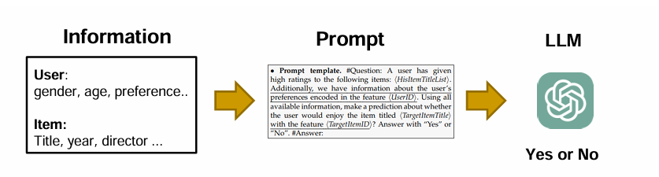
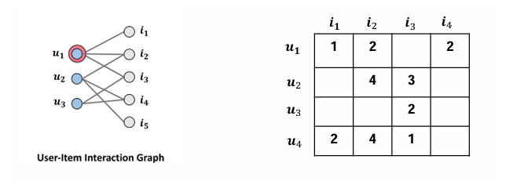
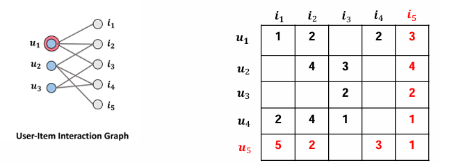
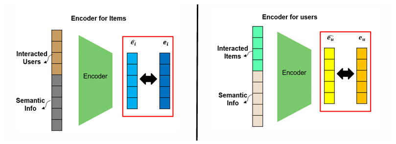
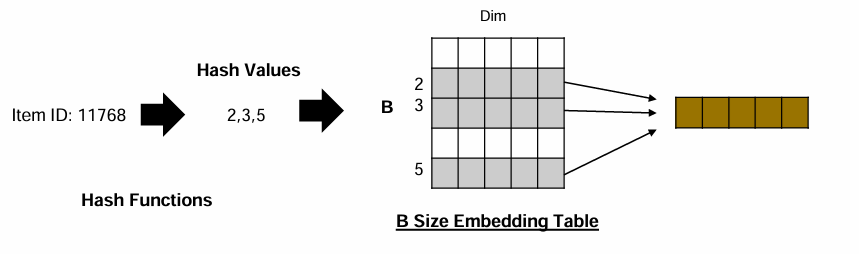
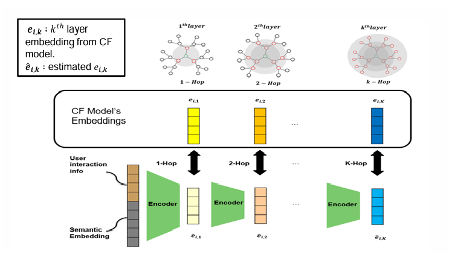
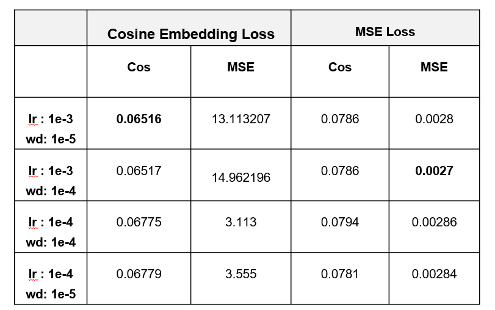

## Full Report

For a more detailed explanation of the overall methodology and experiments, please refer to the full report:

[View Full PDF](./Estimating Collaborative Information to eliminate the need for retraining CF in LLMRecs.pdf)

## Overview
LLM-based recommender systems rely primarily on textual information of users and items.  
While effective, they fail to capture collaborative signals from user-item interactions.

To address this, recent approaches integrate Collaborative Filtering (Cf = GNN based Recommender System) embeddings into LLMs.  
However, these methods require **retraining when new users or items are introduced**, which limits scalability.

**This project proposes a method for estimating CF embeddings (GNN Embeddings) without retraining, enabling more scalable recommendation systems.**

## Problem

When combining LLM recommenders with GNN-based CF recommenders:

- GNN base recommender must be retrained when new users and new items are added.
- Because, there are no trained embeddings on the graph which includes new users and items.
- 

- **LLMs also require additional fine-tuning, as they cannot properly adapt to newly updated CF embeddings.**

This creates a major bottleneck in real-world systems.

## Key Idea

Instead of retraining CF models,  
we **learn a function that estimates CF embeddings** for new users and items.
The goal is to generate user embedding ê_u and item embedding ê_i using two encoders.

without retraining the original CF model (GNN)

## Assumptions
Users' CF embeddings (GNN) and Items' CF embeddings (GNN) are able to estimate using text information and some part of interaction information.

## Method
We propose two encoder models:

### 1. Item Encoder
Input:
- item semantic information
- users who interacted with the item

Output:
- estimated CF embedding of the item

### 2. User Encoder
Input:
- user semantic information
- items the user interacted with

Output:
- estimated CF embedding of the user

##  Technical Details

### (1) Hash Embedding
- Efficient representation of large user/item space
- Uses multiple hash functions to reduce memory usage

### (2) Embedding Alignment
- Align semantic embeddings and interaction embeddings
- Map them into a shared latent space

### (3) Multi-Hop Tuning
- Inspired by GNNs
- Encoders progressively approximate CF embeddings layer-by-layer

## Training Strategy

- Use pretrained CF embeddings as ground truth
- Train encoders to minimize:
  
  || e_cf - ê ||  

- Multi-hop training:
  - each encoder learns layer-specific information

##  Contribution

- Eliminate retraining of CF models
- Enable scalable recommendation with dynamic users/items
- Avoid joint fine-tuning between LLM and CF
- Efficient estimation of collaborative signals

## Takeaways

- This research started from the idea that bridging LLMs and CF models without retraining is critical for real-world deployment.
- Estimating embeddings is more scalable than retraining entire models.
- However, one of the core assumptions of this research turned out to be weak: an encoder may not be able to estimate collaborative information accurately using only textual information and partial interaction data.

- As shown in the figure above, the training loss decreased significantly; however, the validation and test performance remained close to random.
- This indicates that the model only learns patterns specific to the training data and fails to generalize.
- In addition, selecting appropriate user-item interactions during training was not straightforward.
